# fea_cad_one_sample

## Purpose

One-sample CADCodeVerify-to-FEA workflow that loads a single sample, exposes public interfaces/runners for notebooks and CLI, and prepares DB-original State A, State B FEA-constrained revision, manual-FEA, gated State C post-FEA revision, and comparison artifacts.

## What Belongs Here

- Module-specific CLI entry points, public interfaces, runner wrappers, orchestration, schemas, DB loading, CAD execution/export, rendering, FEA artifacts, comparison reports, and inspection notebooks.
- Copied reference helpers preserved under `src/copied_from_cadcodeverify/`.

## What Does NOT Belong Here

- Shared helpers used by multiple modules → project-level `utils/`.
- Production imports from CAD Design → copy into `src/copied_from_cadcodeverify/` instead.
- Notebook-only inspection code → `notebooks/`.

## Layer Diagram

```mermaid
flowchart TD
    N0[notebooks/00_environment_and_db_check.ipynb] --> I[src/interfaces.py]
    N1[notebooks/01_select_and_load_sample.ipynb] --> I
    N2[notebooks/02_state_a_dataset_original.ipynb] --> I
    N3[notebooks/03_state_b_fea_constrained_revision.ipynb] --> I
    N4[notebooks/04_manual_freecad_fea_results_entry.ipynb] --> I
    N5[notebooks/05_state_c_post_fea_revision.ipynb] --> I
    N6[notebooks/06_three_way_visual_analysis.ipynb] --> I
    N7[notebooks/one_sample_fea_inspection.ipynb] --> I
    I --> C[src/cad/]
    I --> D[src/db/]
    I --> P[src/prompts/]
    I --> V[src/visualization/]
    I --> F[src/fea/]
    I --> M[src/reports/]
    I --> P2[src/cad/post_fea_revision.py]
    I --> S[src/schemas/]
    R[src/runners.py] --> O[src/orchestration/pipeline.py]
    O --> M2[src/orchestration/manifest.py]
    O --> D
    O --> C
    O --> P
    O --> V
    O --> F
    O --> M
    D --> S
    C --> S
    P --> S
    F --> S
    M --> S
    M2 --> S
```

## Entry Points

| File | Purpose |
|---|---|
| `src/interfaces.py` | Public API surface for tests and notebooks |
| `src/runners.py` | Thin workflow orchestration entry points |
| `src/main.py` | CLI commands |
| `notebooks/00_environment_and_db_check.ipynb` | Environment, config, and DB access check notebook using only `src.interfaces` |
| `notebooks/01_select_and_load_sample.ipynb` | Fixed sample selection and lock notebook using only `src.interfaces` |
| `notebooks/02_state_a_dataset_original.ipynb` | State A original CAD execution and visualization notebook using only `src.interfaces` |
| `notebooks/03_state_b_fea_constrained_revision.ipynb` | State B FEA-constrained revision notebook using only `src.interfaces` |
| `notebooks/04_manual_freecad_fea_results_entry.ipynb` | Manual FreeCAD FEM results entry notebook using only `src.interfaces` |
| `notebooks/05_state_c_post_fea_revision.ipynb` | State C post-FEA revision notebook using only `src.interfaces` |
| `notebooks/06_three_way_visual_analysis.ipynb` | Three-way comparison notebook using only `src.interfaces` |
| `notebooks/one_sample_fea_inspection.ipynb` | Legacy overview/index notebook using only `src.interfaces` |

## How to Run

- **CLI:** `python -m src.main --help`
- **Inspect schema:** `python -m src.main inspect-schema --config config_gpt_5_4_mini.yaml`
- **State commands:** `python -m src.main state-a --sample-id sample-001 --config config_gpt_5_4_mini.yaml`, `state-b`, `state-c`, and `comparison`
- **Compatibility aliases:** `python -m src.main run --expert-random --config config_gpt_5_4_mini.yaml` and `compare`
- **Notebook overview:** open `notebooks/one_sample_fea_inspection.ipynb`
- **Walkthrough:** open `notebooks/00_environment_and_db_check.ipynb` then `01_select_and_load_sample.ipynb` through `06_three_way_visual_analysis.ipynb`
- **Tests:** `pytest tests -q`

## Internal Structure

| Directory / File | Responsibility |
|---|---|
| `notebooks/` | Inspection workflow and public-surface validation |
| `notebooks/00_environment_and_db_check.ipynb` | Environment, config, and DB access check |
| `notebooks/01_select_and_load_sample.ipynb` | Fixed sample selection and lock |
| `notebooks/02_state_a_dataset_original.ipynb` | State A baseline execution and visualization |
| `notebooks/03_state_b_fea_constrained_revision.ipynb` | State B FEA-constrained revision |
| `notebooks/04_manual_freecad_fea_results_entry.ipynb` | Manual FreeCAD FEM results entry |
| `notebooks/05_state_c_post_fea_revision.ipynb` | State C post-FEA revision |
| `notebooks/06_three_way_visual_analysis.ipynb` | Three-way comparison and final report |
| `notebooks/one_sample_fea_inspection.ipynb` | Legacy overview/index |
| `outputs/` | Generated run artifacts |
| `src/schemas/` | Data contracts |
| `src/orchestration/` | Workflow composition and run-manifest persistence |
| `src/db/` | Schema inspection and sample loading |
| `src/cad/` | CadQuery execution and revision/export |
| `src/prompts/` | FEA revision prompt construction |
| `src/visualization/` | Rendering, annotated views, and comparison images |
| `src/fea/` | Manual FreeCAD FEM instructions, manual report template, and post-FEA prompt artifacts |
| `src/cad/post_fea_revision.py` | Gated State C revision generation and export helpers |
| `src/reports/` | Comparison markdown artifacts, including the post-FEA comparison template |
| `src/copied_from_cadcodeverify/` | Local copies of approved reference helpers |
