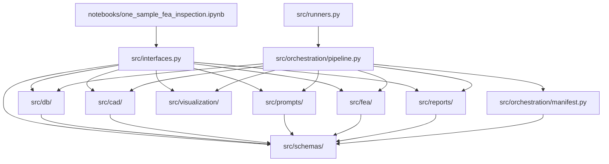

# fea_cad_one_sample

## Purpose

One-sample CADCodeVerify-to-FEA workflow that loads a single sample, exposes public interfaces/runners for notebooks and CLI, and prepares baseline, FEA-ready, manual-FEA, and post-FEA artifacts.

## What Belongs Here

- Module-specific CLI entry points, public interfaces, runner wrappers, orchestration, schemas, DB loading, CAD execution/export, rendering, FEA artifacts, comparison reports, and inspection notebooks.
- Copied reference helpers preserved under `src/copied_from_cadcodeverify/`.

## What Does NOT Belong Here

- Shared helpers used by multiple modules → project-level `utils/`.
- Production imports from CAD Design → copy into `src/copied_from_cadcodeverify/` instead.
- Notebook-only inspection code → `notebooks/`.

## Layer Diagram

## Entry Points

| File | Purpose |
|---|---|
| `src/interfaces.py` | Public API surface for tests and notebooks |
| `src/runners.py` | Thin workflow orchestration entry points |
| `src/main.py` | CLI commands |
| `notebooks/one_sample_fea_inspection.ipynb` | Public inspection notebook using only `src.interfaces` |

## How to Run

- **CLI:** `python -m src.main --help`
- **Inspect schema:** `python -m src.main inspect-schema --config config_gpt_5_4_mini.yaml`
- **Full run:** `python -m src.main run --expert-random --config config_gpt_5_4_mini.yaml`
- **Notebook:** open `notebooks/one_sample_fea_inspection.ipynb`
- **Tests:** `pytest tests -q`

## Internal Structure

| Directory / File | Responsibility |
|---|---|
| `notebooks/` | Inspection workflow and public-surface validation |
| `outputs/` | Generated run artifacts |
| `src/schemas/` | Data contracts |
| `src/orchestration/` | Workflow composition and run-manifest persistence |
| `src/db/` | Schema inspection and sample loading |
| `src/cad/` | CadQuery execution and export |
| `src/prompts/` | FEA prompt construction |
| `src/visualization/` | Rendering and comparison images |
| `src/fea/` | Manual FreeCAD FEM instructions, manual report template, and post-FEA prompt artifacts |
| `src/reports/` | Comparison markdown artifacts, including the post-FEA comparison template |
| `src/copied_from_cadcodeverify/` | Local copies of approved reference helpers |
