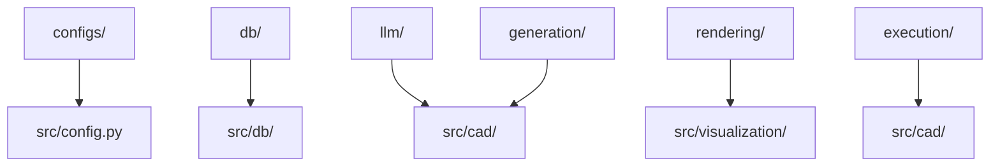

# copied_from_cadcodeverify

## Purpose

Reference copies of CAD Design helpers and config assets that this standalone project can wrap without importing CAD Design at runtime.

## What Belongs Here

- Verbatim copies of approved CAD Design helper files.
- Source-path comments at the top of copied Python files.
- Copied config YAMLs under `configs/`.

## What Does NOT Belong Here

- New project logic → `src/` feature modules.
- Shared utilities used across projects → project-level `utils/`.
- Runtime imports from CAD Design → never; copy the source file instead.

## Layer Diagram



## CAD Design source inventory

### Copied files

| Source path | Planned local copy |
|---|---|
| `code_base/config/config_gpt_5_4_mini.yaml` | `configs/config_gpt_5_4_mini.yaml` |
| `code_base/config/config_gptoss_openrotuer.yaml` | `configs/config_gptoss_openrotuer.yaml` |
| `code_base/config/config_qwen_coder.yaml` | `configs/config_qwen_coder.yaml` |
| `utils/config_loader.py` | `db/config_loader.py` |
| `utils/db/reader.py` | `db/reader.py` |
| `utils/db/utilities/db_handler.py` | `db/utilities/db_handler.py` |
| `utils/llm/llm.py` | `llm/llm.py` |
| `utils/evaluation/python_kernel.py` | `execution/python_kernel.py` |
| `agentic_closed_loop/modules/visual_analysis/rendering/config.py` | `rendering/config.py` |
| `agentic_closed_loop/modules/visual_analysis/rendering/db_loader.py` | `rendering/db_loader.py` |
| `agentic_closed_loop/modules/load_data/core/model_config.py` | `db/model_config.py` |
| `agentic_closed_loop/modules/load_data/core/paths.py` | `db/paths.py` |
| `agentic_closed_loop/modules/load_data/data_loading/assets.py` | `db/assets.py` |
| `agentic_closed_loop/modules/load_data/data_loading/programs.py` | `db/programs.py` |
| `agentic_closed_loop/modules/load_data/services/connections.py` | `db/connections.py` |
| `agentic_closed_loop/modules/generation/parsing/responses.py` | `generation/parsing/responses.py` |
| `agentic_closed_loop/modules/generation/schemas/batch.py` | `generation/schemas/batch.py` |
| `agentic_closed_loop/modules/generation/services/generator.py` | `generation/services/generator.py` |
| `agentic_closed_loop/modules/visual_analysis/rendering/renderer.py` | `rendering/renderer.py` |
| `agentic_closed_loop/modules/visual_analysis/rendering/pointcloud_loader.py` | `rendering/pointcloud_loader.py` |
| `agentic_closed_loop/modules/visual_analysis/rendering/grid_export.py` | `rendering/grid_export.py` |
| `agentic_closed_loop/modules/visual_analysis/rendering/schema.py` | `rendering/schema.py` |
| `agentic_closed_loop/modules/visual_analysis/rendering/comparison_metrics.py` | `rendering/comparison_metrics.py` |

## How to Inspect

```bash
rg -n "CAD Design source inventory|Copied files" code_base/fea_cad_one_sample/src/copied_from_cadcodeverify/README.md
```
