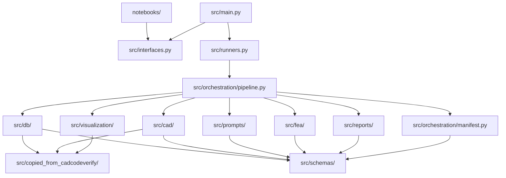

# CODEBASE_MAP.md

> Agent-facing map for CAD-Physics. Update this file whenever module structure, public APIs, or ownership changes.

## Current State

CAD-Physics now has a created `code_base/fea_cad_one_sample/` module skeleton with README, packaging files, the `src/` directory layout, and the Phase 12 inspection notebook. Phase 11 has added the public interface surface, thin runner layer, run-manifest writer, pipeline orchestration, and CLI commands on top of the manual FreeCAD FEM and post-FEA artifact writers.

The main intent is captured in `conversations/01-start.md`: move CADCodeVerify from geometry-only CAD toward physics-aware CAD by preparing a STEP-first, manual-FEA-ready workflow with structured load cases and feedback artifacts.

## Module Dependency Diagram



## Top-Level Directory Structure

```text
CAD-Physics/
  code_base/
    fea_cad_one_sample/
      README.md
      pyproject.toml
      requirements.txt
      notebooks/
      outputs/
      src/
      tests/
  conversations/
  docs/
    ai_context/
      DOC_TAXONOMY.md
      CODEBASE_MAP.md
      SYSTEM_WORKFLOW_MAP.md
    execution-plans/
    gpt-specs/
```

## Module Ownership

| Module | Purpose | Owns | Does NOT Own |
|---|---|---|---|
| `code_base/fea_cad_one_sample/` | One-sample CAD prompt to FEA-ready CAD workflow | Module-local orchestration, sample loading, CAD execution/export, rendering, FEA artifacts, copied reference helpers | Multi-sample benchmarks, automated FEA, training, CAD Design runtime package ownership |
| `docs/execution-plans/` | Pi execution instructions | Protocol, local spec, architecture, microtasks, checkpoints, handoff template | Runtime code |
| `docs/execution-plans/06-pi-sequential-execution-prompt.md` | Pi execution launcher | Sequential task-loop prompt, context-stop behavior, final acceptance reminders | Source code |
| `docs/ai_context/` | Agent orientation maps | Documentation taxonomy, codebase map, and workflow map | Feature requirements |

## Public Entry Points

| Module | File | Public Functions |
|---|---|---|
| `fea_cad_one_sample` | `src/interfaces.py` | Public re-export surface for schema types and stable functions |
| `fea_cad_one_sample` | `src/runners.py` | Thin public runner functions for schema, pipeline, and artifact stages |
| `fea_cad_one_sample` | `src/main.py` | CLI entry point for inspect-schema, run, render-only, build-fea-prompt, build-freecad-instructions, and compare |
| `fea_cad_one_sample` | `notebooks/one_sample_fea_inspection.ipynb` | Public inspection notebook that exercises `src.interfaces` only |

## Schemas And Data Contracts

| Schema | Location | Used By |
|---|---|---|
| `CADSample` | `src/schemas/sample.py` | DB loader, generation, prompt builder |
| `PipelineConfig` | `src/schemas/config.py` | CLI, runners, pipeline |
| `LoadCase` | `src/schemas/fea.py` | FEA prompt, load-case writer, FreeCAD docs |
| `ManualFEAReport` | `src/schemas/fea.py` | manual report writer, post-FEA prompt |
| `PipelineSummary` | `src/schemas/pipeline.py` | pipeline, CLI output, manifest |
| `RunManifestRecord` | `src/schemas/pipeline.py` | manifest writer and stage tracking |

## What Not To Duplicate

- Do not reimplement copied CAD Design helpers in multiple local modules.
- Do not put production logic in notebooks.
- Do not put business logic in `src/main.py`, `src/runners.py`, or `src/orchestration/pipeline.py`.
- Do not import from CAD Design in production code unless the user approves a spec change.
- Do not automate FreeCAD or CalculiX in this first prototype.

## Module Inventory

| Module | Public Files | Notes |
|---|---|---|
| `fea_cad_one_sample` | `interfaces.py`, `runners.py`, `main.py`, `notebooks/one_sample_fea_inspection.ipynb` | Public surface and inspection notebook in place |
| `fea_cad_one_sample` | `schemas/`, `orchestration/`, `db/`, `cad/`, `prompts/`, `visualization/`, `fea/`, `reports/`, `copied_from_cadcodeverify/` | Directory ownership established; Phase 12 now includes the inspection notebook plus the Phase 11 public APIs, orchestration, and CLI |

## Known Gaps / Technical Debt

- Core production logic for Phases 5-11 is now implemented; Phase 12 notebook/docs work remains.
- DB and model environment variables are still required for live runs.
- Real DB schema must be inspected before assuming expert-prompt field names.
- `cad_physics` exists now; the old gap note is resolved.

## Changelog

| Date | Change |
|---|---|
| 2026-06-24 | Marked `fea_cad_one_sample` skeleton as created and updated ownership tables. |
| 2026-06-24 | Added documentation taxonomy, sequential Pi prompt ownership, and main-intent guardrail. |
| 2026-06-24 | Created initial map for planned one-sample FEA-ready CAD prototype. |
| 2026-06-24 | Updated public interfaces, runner layer, run manifest, orchestration pipeline, and CLI surface for Phase 11. |
