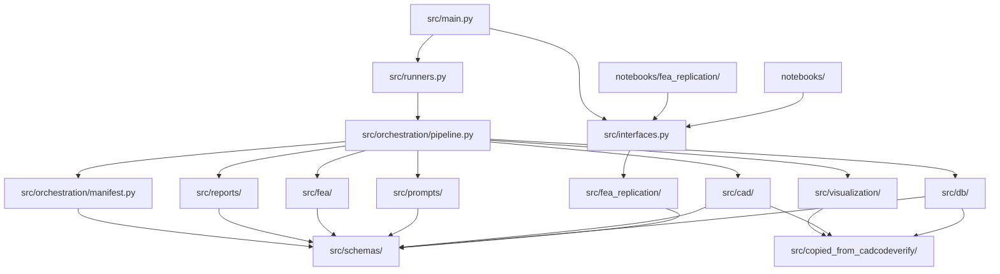

# CODEBASE_MAP.md

> Agent-facing map for CAD-Physics. Update this file whenever module structure, public APIs, or ownership changes.

## Current State

CAD-Physics now has a created `code_base/fea_cad_one_sample/` module skeleton with README, packaging files, the `src/` directory layout, the real Phase-6 notebook walkthrough spanning sample selection, State A, State B, manual FEA handoff, gated State C, and final comparison, and a new deterministic FEA replication notebook series under `notebooks/fea_replication/`. Phase 11 added the public interface surface, thin runner layer, run-manifest writer, pipeline orchestration, and CLI commands on top of the manual FreeCAD FEM and post-FEA artifact writers, while `src/fea_replication/` now adds the standalone STEP→Gmsh→CalculiX flow for a single beam model.

The main intent is captured in `conversations/01-start.md`: move CADCodeVerify from geometry-only CAD toward physics-aware CAD by preparing a STEP-first, manual-FEA-ready workflow with structured load cases and feedback artifacts.

## Module Dependency Diagram



## Top-Level Directory Structure

```text
CAD-Physics/
  code_base/
    fea_cad_one_sample/
      README.md
      pyproject.toml
      requirements.txt
      notebooks/
      outputs/
      src/
      notebooks/fea_replication/
      src/fea_replication/
      tests/
  conversations/
  docs/
    ai_context/
      DOC_TAXONOMY.md
      CODEBASE_MAP.md
      SYSTEM_WORKFLOW_MAP.md
    execution-plans/
    gpt-specs/
```

## Module Ownership

| Module | Purpose | Owns | Does NOT Own |
|---|---|---|---|
| `code_base/fea_cad_one_sample/` | One-sample CAD prompt to FEA-ready CAD workflow | Module-local orchestration, sample loading, CAD execution/export, rendering, FEA artifacts, copied reference helpers | Multi-sample benchmarks, automated FEA, training, CAD Design runtime package ownership |
| `docs/execution-plans/` | Pi execution instructions | Protocol, local spec, architecture, microtasks, checkpoints, handoff template | Runtime code |
| `docs/execution-plans/06-pi-sequential-execution-prompt.md` | Pi execution launcher | Sequential task-loop prompt, context-stop behavior, final acceptance reminders | Source code |
| `docs/ai_context/` | Agent orientation maps | Documentation taxonomy, codebase map, and workflow map | Feature requirements |
| `code_base/fea_cad_one_sample/notebooks/fea_replication/` | Deterministic STEP→mesh→CalculiX notebook series | Geometry loading, mesh generation, solver execution, result parsing, and parametric study walkthrough | Manual FEA handoff notebooks and comparison notebooks |

## Public Entry Points

| Module | File | Public Functions |
|---|---|---|
| `fea_cad_one_sample` | `src/interfaces.py` | Public re-export surface for schema types and stable functions, including the FEA replication helpers |
| `fea_cad_one_sample` | `src/runners.py` | Thin public runner functions for schema, pipeline, and artifact stages |
| `fea_cad_one_sample` | `src/main.py` | CLI entry point for inspect-schema, run, render-only, build-fea-prompt, build-freecad-instructions, and compare |
| `fea_cad_one_sample` | `notebooks/00_select_real_sample.ipynb` | Phase-6 sample-selection notebook for the canonical sample tree |
| `fea_cad_one_sample` | `notebooks/fea_replication/` | Deterministic STEP, mesh, solver, result, and parametric-study notebook series |
| `fea_cad_one_sample` | `notebooks/01_state_a_dataset_original.ipynb` | Phase-2 State A inspection notebook for DB-original artifacts |
| `fea_cad_one_sample` | `notebooks/02_state_b_fea_revision.ipynb` | Phase-3 State B inspection notebook for revision artifacts |
| `fea_cad_one_sample` | `notebooks/03_manual_freecad_fea_handoff.ipynb` | Phase-6 manual FEA handoff notebook |
| `fea_cad_one_sample` | `notebooks/04_state_c_post_fea_revision.ipynb` | Phase-6 gated State C notebook |
| `fea_cad_one_sample` | `notebooks/05_final_abc_comparison.ipynb` | Phase-6 final A/B/C comparison notebook |
| `fea_cad_one_sample` | `notebooks/one_sample_fea_inspection.ipynb` | Public overview notebook that exercises `src.interfaces` only |

## Schemas And Data Contracts

| Schema | Location | Used By |
|---|---|---|
| `CADSample` | `src/schemas/sample.py` | DB loader, generation, prompt builder |
| `PipelineConfig` | `src/schemas/config.py` | CLI, runners, pipeline |
| `FEAReplicationConfig` | `src/fea_replication/schemas.py` | Deterministic geometry, mesh, solver, and parametric study notebooks |
| `MaterialSpec` / `LoadSpec` / `BoundaryConditionSpec` / `VerificationCriteria` | `src/fea_replication/schemas.py` | Notebook 03 configuration and CalculiX input generation |
| `GeometrySummary` / `RegionSelectionSummary` / `MeshSummary` / `SolverRunSummary` / `ParsedResultSummary` | `src/fea_replication/schemas.py` | Notebook stage summaries and result verification |
| `LoadCase` | `src/schemas/fea.py` | FEA prompt, load-case writer, FreeCAD docs |
| `SelectorHints` | `src/schemas/fea.py` | State B prompt builder, selector-hints writer |
| `RevisionChangeLog` | `src/schemas/fea.py` | State B revision logging and machine-readable change log |
| `ManualFEAReport` | `src/schemas/fea.py` | manual report writer, post-FEA prompt |
| `PipelineSummary` | `src/schemas/pipeline.py` | pipeline, CLI output, manifest |
| `FEARevisionResult` | `src/schemas/pipeline.py` | State B revision outputs and artifact tracking |
| `PostFEARevisionResult` | `src/schemas/pipeline.py` | State C revision outputs and artifact tracking |
| `RunManifestRecord` | `src/schemas/pipeline.py` | manifest writer and stage tracking |

## What Not To Duplicate

- Do not reimplement copied CAD Design helpers in multiple local modules.
- Do not reimplement geometry selection, mesh writing, solver execution, or result parsing outside `src/fea_replication/`.
- Do not put production logic in notebooks.
- Do not put business logic in `src/main.py`, `src/runners.py`, or `src/orchestration/pipeline.py`.
- Do not import from CAD Design in production code unless the user approves a spec change.
- Do not automate FreeCAD or CalculiX in this first prototype.

## Module Inventory

| Module | Public Files | Notes |
|---|---|---|
| `fea_cad_one_sample` | `interfaces.py`, `runners.py`, `main.py`, `notebooks/00_select_real_sample.ipynb`, `notebooks/01_state_a_dataset_original.ipynb`, `notebooks/02_state_b_fea_revision.ipynb`, `notebooks/03_manual_freecad_fea_handoff.ipynb`, `notebooks/04_state_c_post_fea_revision.ipynb`, `notebooks/05_final_abc_comparison.ipynb`, `notebooks/fea_replication/`, `notebooks/one_sample_fea_inspection.ipynb` | Public surface and inspection notebooks in place |
| `fea_cad_one_sample` | `schemas/`, `orchestration/`, `db/`, `cad/`, `prompts/`, `visualization/`, `fea/`, `reports/`, `fea_replication/`, `copied_from_cadcodeverify/` | Directory ownership established; Phase 3 adds the State B revision path, Phase 5 adds the gated post-FEA State C path, Phase 6 adds the real multi-notebook walkthrough, and the new FEA replication package adds the standalone deterministic CalculiX study |

## Known Gaps / Technical Debt

- Core production logic for Phases 5-11 is now implemented; Phase 6 notebook walkthrough is now in place, and Phase 7 CLI/docs cleanup plus final acceptance remain.
- DB and model environment variables are still required for live runs.
- Real DB schema must be inspected before assuming expert-prompt field names.
- `cad_physics` exists now; the old gap note is resolved.
- State B revision artifacts now live under `outputs/sample_<sample_id>/02_fea_constrained_revision/`.
- Manual FEA handoff artifacts live under `outputs/sample_<sample_id>/04_manual_freecad_fea/`.
- State C revision artifacts now live under `outputs/sample_<sample_id>/05_post_fea_revision/` when manual FEA evidence is complete.
- The notebook walkthrough now spans `00_select_real_sample.ipynb` through `05_final_abc_comparison.ipynb` plus the overview notebook.
- The new `notebooks/fea_replication/` series is separate from the original CADCodeVerify walkthrough and intentionally uses a placeholder beam unless a STEP source is provided.
- `ccx` is required for notebooks 04-06 to complete on a machine with the CalculiX solver installed.

## Changelog

| Date | Change |
|---|---|
| 2026-06-24 | Marked `fea_cad_one_sample` skeleton as created and updated ownership tables. |
| 2026-06-24 | Added documentation taxonomy, sequential Pi prompt ownership, and main-intent guardrail. |
| 2026-06-24 | Created initial map for planned one-sample FEA-ready CAD prototype. |
| 2026-06-24 | Updated public interfaces, runner layer, run manifest, orchestration pipeline, and CLI surface for Phase 11. |
