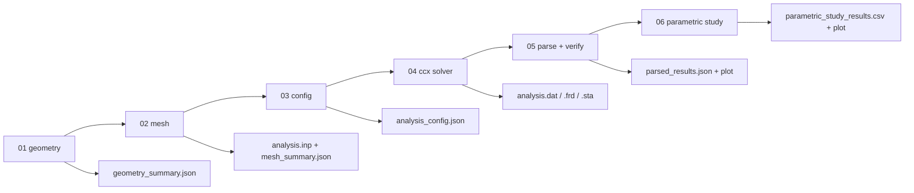

# SYSTEM_WORKFLOW_MAP.md

> Planned workflow map for the CAD-Physics one-sample FEA-ready CAD prototype. Update when pipeline stages change.

## Planned End-To-End Flow

This workflow is the first project step toward physics-aware CAD generation. It does not automate FEA; it prepares the geometry, load case, manual solver instructions, and feedback prompt needed to connect CADCodeVerify-style generation to engineering verification. The corrected remediation now treats State A as immutable DB-original input, State B as the FEA-constrained revision under `02_fea_constrained_revision/`, and State C as the gated post-FEA revision under `05_post_fea_revision/`.

```mermaid
flowchart LR
    A[Start CLI] --> A1[Parse command in src/main.py]
    A1 --> A2[Dispatch through src/runners.py]
    A2 --> B[Load config]
    B --> C[Inspect DB schema]
    C --> D[Load expert prompt sample]
    D --> E[Persist DB-original State A]
    E --> F[Execute and export original STEP/STL]
    F --> G[Render original views + grid]
    G --> H[Build State B revision prompt]
    H --> I[Write load_case.json + selector_hints.json]
    I --> J[Generate State B revision code + change log]
    J --> K[Execute and export fea_revision STEP/STL]
    K --> L[Render State B views + grid + annotation]
    L --> M[Build visual and prompt comparisons]
    M --> N[Write FreeCAD FEM instructions]
    N --> O[Write fea_report.json template]
    O --> P[Validate manual FEA evidence]
    P --> Q[Generate post-FEA revision code]
    Q --> R[Execute and export post_fea STEP/STL]
    R --> S[Render State C views + grid]
    S --> T[Update run_manifest.json incrementally]
    T --> U[Print output summary]

    C -->|schema missing expert prompt| V[Stop with readable DB error]
    E -->|original code missing| W[Write State A failure log]
    I -->|revision prompt generation fails| X[Write revision failure log]
    K -->|CadQuery/export fails| Y[Write execution_log.txt]
    O -->|manual evidence incomplete| Z[Mark State C blocked in manifest]
```

## Notebook Inspection Flow

- The inspection notebooks must stay read-only with respect to source files, except for the manual FEA handoff template notebook that writes the canonical report/instruction files under `04_manual_freecad_fea/`.
- Notebook artifacts, if any, should live under the canonical `outputs/sample_<sample_id>/` tree.
- Notebook 00 selects the real sample; notebook 01 covers State A; notebook 02 covers State B; notebook 03 covers manual FEA handoff; notebook 04 covers the gated State C path; notebook 05 covers final comparison; and `one_sample_fea_inspection.ipynb` provides a read-only overview across the whole tree.

## Deterministic FEA Replication Flow

This standalone notebook series lives under `notebooks/fea_replication/` and writes its outputs to `outputs/fea_replication/baseline/`. It uses a simple beam placeholder by default and can be pointed at a STEP file when one is available.

- Notebook 04 and 06 require `ccx` on `PATH`.
- Notebook 05 records stress parsing as TODO when the `.dat` format does not expose a usable stress block.
- The notebook series is deterministic: each stage can be rerun with the same explicit configuration and will rewrite the same run directory artifacts.

## Manual FreeCAD FEM Flow

## Workflow Rules

- STEP is the primary engineering handoff format.
- STL is for rendering and mesh preview.
- FreeCAD and CalculiX are manual only in v1.
- State C must remain blocked until required manual FEA values and screenshots/result files are present.
- Each automated stage must write or update a status entry in `run_manifest.json`.
- Each CAD execution stage must write `execution_log.txt`.
- Documentation updates are part of the workflow; Pi must keep `DOC_TAXONOMY.md`, `CODEBASE_MAP.md`, `SYSTEM_WORKFLOW_MAP.md`, module README, and `docs/session_state.md` current as implementation proceeds.
