# SYSTEM_WORKFLOW_MAP.md

> Planned workflow map for the CAD-Physics one-sample FEA-ready CAD prototype. Update when pipeline stages change.

## Planned End-To-End Flow

This workflow is the first project step toward physics-aware CAD generation. It does not automate FEA; it prepares the geometry, load case, manual solver instructions, and feedback prompt needed to connect CADCodeVerify-style generation to engineering verification.

```mermaid
flowchart LR
    A[Start CLI] --> B[Load config]
    B --> C[Inspect DB schema]
    C --> D[Load expert prompt sample]
    D --> E[Generate baseline CadQuery code]
    E --> F[Execute and export original STEP/STL]
    F --> G[Render original views]
    G --> H[Build FEA-ready prompt]
    H --> I[Write load_case.json]
    I --> J[Generate FEA-ready CadQuery code]
    J --> K[Execute and export FEA-ready STEP/STL]
    K --> L[Render FEA-ready views]
    L --> M[Build visual and prompt comparisons]
    M --> N[Write FreeCAD FEM instructions]
    N --> O[Write fea_report.json template]
    O --> P[Write post-FEA refinement prompt]
    P --> Q[Write run_manifest.json]
    Q --> R[Print output summary]

    C -->|schema missing expert prompt| S[Stop with readable DB error]
    E -->|model generation fails| T[Write generation failure log]
    F -->|CadQuery/export fails| U[Write execution_log.txt]
    K -->|FEA-ready export fails| V[Write execution_log.txt]
```

## Manual FreeCAD FEM Flow

## Workflow Rules

- STEP is the primary engineering handoff format.
- STL is for rendering and mesh preview.
- FreeCAD and CalculiX are manual only in v1.
- Each automated stage must write a status entry into `run_manifest.json`.
- Each CAD execution stage must write `execution_log.txt`.
- Documentation updates are part of the workflow; Pi must keep `DOC_TAXONOMY.md`, `CODEBASE_MAP.md`, `SYSTEM_WORKFLOW_MAP.md`, module README, and `docs/session_state.md` current as implementation proceeds.
